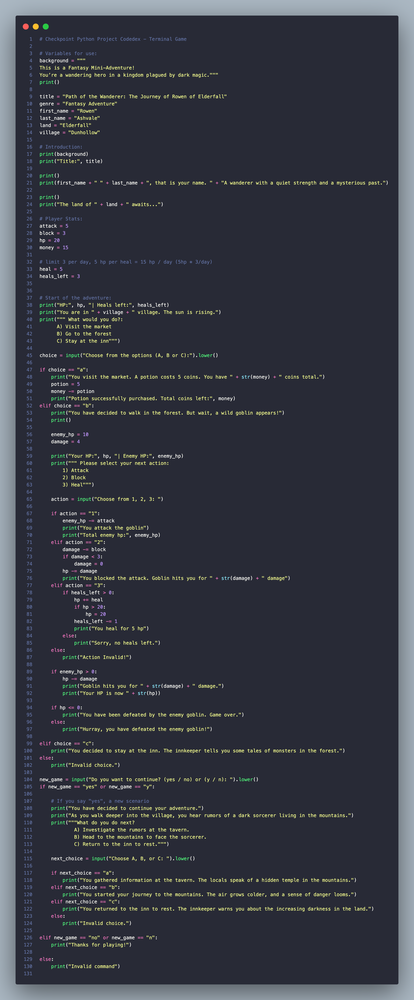

# Codedex Python Checkpoint Project:

# Fantasy Mini-Adventure: Path of the Wanderer

## Overview

This is a text-based fantasy adventure game where you play as **Rowen Ashvale**, a wandering hero in the kingdom of **Elderfall**. You will face challenges, make decisions, and explore different paths in your journey.

## Gameplay

In this game, you'll make choices that affect your adventure. You can visit the market, venture into the forest, or stay at the inn. You'll encounter enemies like goblins and make decisions about how to handle them—whether to attack, block, or heal.

Your stats include health (HP), attack, block, and healing potions. Use your resources wisely to survive and defeat enemies!

### Features

- **Explore the world**: Visit different locations in the village and beyond.
- **Combat system**: Fight against enemies with your attack, block, and healing options.
- **Decision-making**: Choose your actions and shape your adventure.

## Screenshot

## How to Play

1. Run the Python script.
2. Follow the on-screen prompts to make decisions.
3. Keep track of your stats and resources.
4. See where your journey takes you!

Enjoy the adventure!

