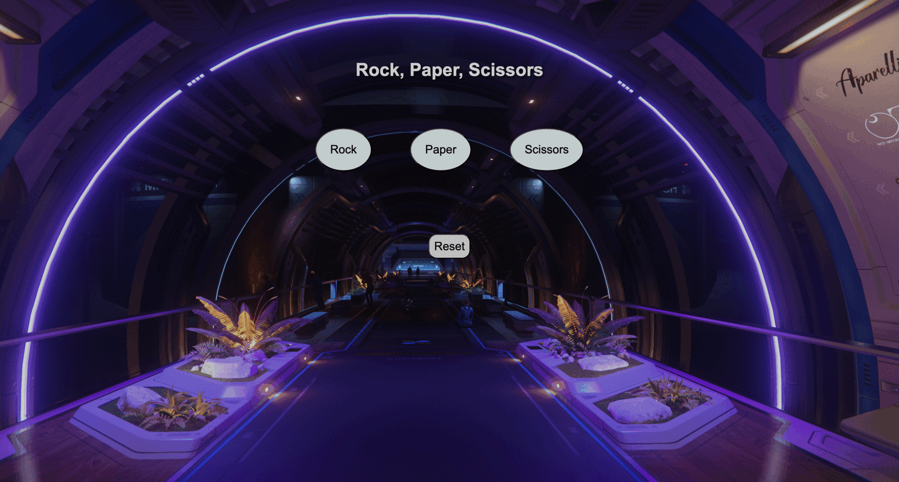

# Rock Paper Scissors




This is the final project for the Codedex Python course.

🔍 Overview

- It’s a simple **Rock Paper Scissors** game built with Python and Flask and displayed on a webpage.

- You click a button to make your move, and the computer picks one at random. Then the app shows who won.
- Click the **reset** button to clear the previous result, player choice, and computer move.
    - It resets the game to its initial state. 


## Technologies Used

- Python
- Flask
- HTML/CSS

## Folder Structure

```text
final_project/
├── app.py
├── README.md
├── game.gif
├── game_screenshot.png
├── static/
│   └── main.css
└── templates/
    └── index.html
```


## Navigate to the folder

- cd final_project


## Install virtual environment

- python -m venv venv


# Activate the venv

- source venv/bin/activate -> macOS/Linux

- venv\Scripts\activate -> Windows


# Install dependencies

- pip install flask


# Run the flask app

- python app.py  OR python3 app.py


# Open browser and go to

http://127.0.0.1:5000


P.S. if you want to run the app.py normally without flask:

make sure to comment out this:

```text
if __name__ == '__main__':
    app.run(debug=True)
```
