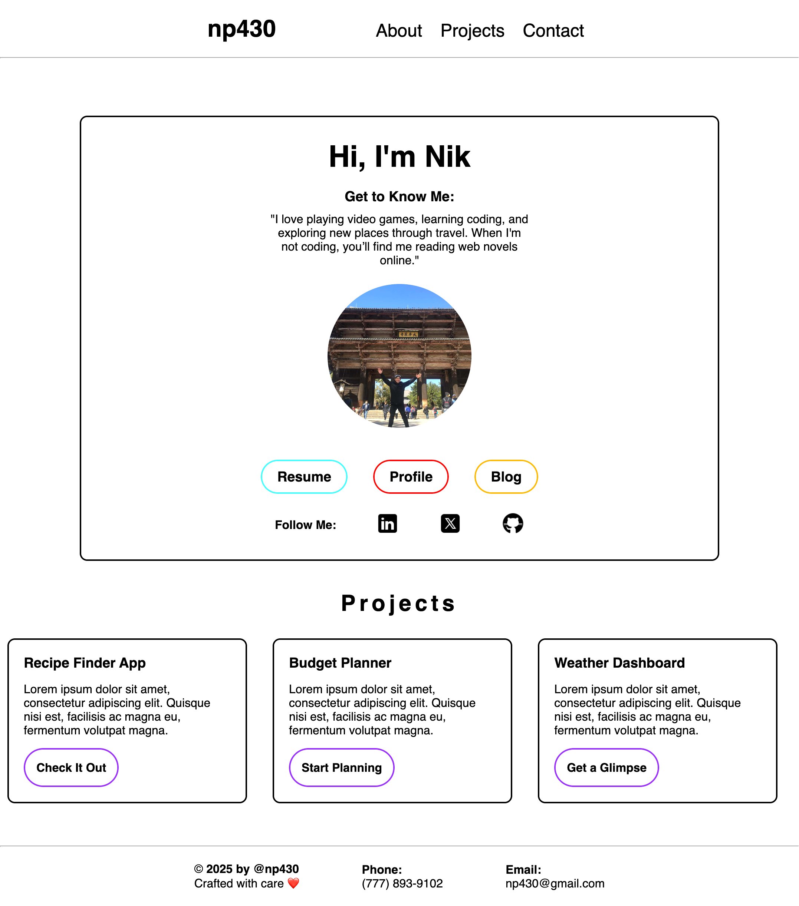

# Personal Website Project 🌐

Welcome to the final project for the CSS course! 🎉 This project will showcase everything you've learned in HTML and CSS while building a personal website. It's an invaluable tool for self-expression and an essential part of any web developer’s portfolio.

## Project Structure

- `index.html`: The main HTML file that structures the content of the site.
- `styles.css`: The CSS file where all the styling for the site is defined.

## Sections of the Website

### 1. **About Me**
   - A brief introduction about yourself.
   - Includes a profile picture and a short bio.

### 2. **Projects**
   - Displays a list of your notable projects.
   - Each project has a title, description, and a link to the live project (if available).

### 3. **Contact**
   - Provides contact details such as email and phone.
   - Includes social media icons linking to your profiles (LinkedIn, Twitter, GitHub).

## Style with CSS

The website is styled using CSS, which includes:

- **Selectors** to target elements and apply styles.
- Properties like **color**, **font**, **text alignment**, and **background**.
- Modifications to the **box model**, including **width/height**, **padding**, **margin**, and **border**.
- **Positioning** of elements on the page to create a clean and organized layout.

## Screenshot

Here’s a preview of how the website looks:

---

Thanks for checking out my personal website project! 😊

