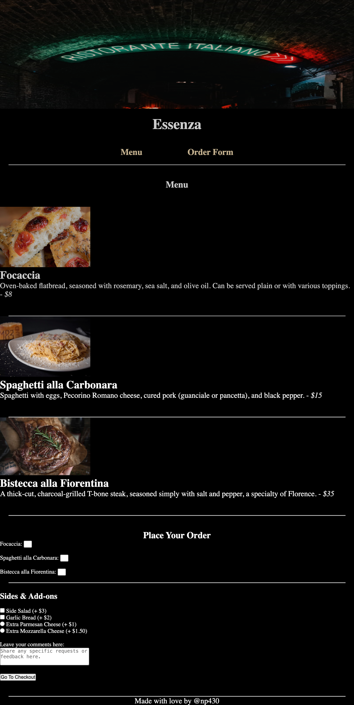

# Essenza - Restaurant Menu

Welcome to **Essenza**, a simple and elegant restaurant menu website created with HTML. This project features a menu of three dishes, with an order form for selecting quantities and add-ons. 

## Features

- **Menu Section**: Includes 3 menu items, each with an image, description, and price.
- **Order Form**: Allows users to select quantities for each dish and add-ons such as garlic bread and side salad.
- **Checkout Button**: A button to simulate proceeding to checkout.
- **Personalized Footer**: A footer that credits the creator with a personal touch.

## Screenshots

## Project Structure

- **`restaurant_menu.html`**: The main HTML file containing the restaurant menu and order form.
- **`focaccia.jpg`**: Image of the Focaccia dish.
- **`carbonara.jpg`**: Image of the Spaghetti alla Carbonara dish.
- **`bistecca.jpg`**: Image of the Bistecca alla Fiorentina dish.
- **`restaurante-italiano.jpg`**: Header image with the text "Ristorante Italiano".
- **`restaurant_menu.html.png`**: Screenshot of the project for preview purposes.

## How to Use

1. Clone or download the repository.
2. Open the `restaurant_menu.html` file in any browser (e.g., Google Chrome, Firefox).
3. Explore the menu and use the order form to simulate an order!

## Contributing

Feel free to fork this repository, make improvements, and submit pull requests. Contributions are always appreciated!

## License

This project is open-source and available under the [MIT License](LICENSE).

