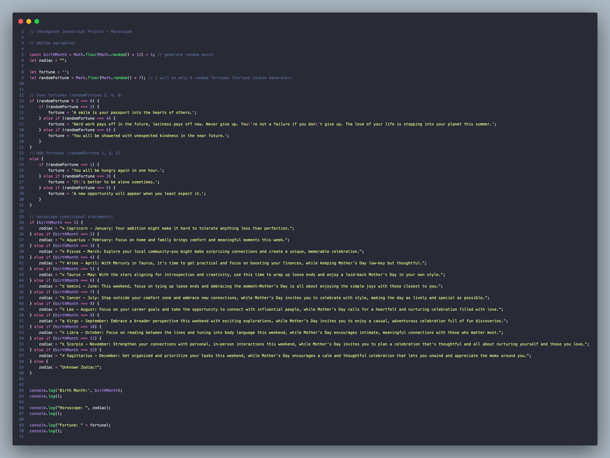

# 🌟 Horoscope JavaScript Checkpoint Project ⛳️

Hey there! I created this project as part of my JavaScript learning journey with **Codedex**. 

After completing the first four chapters of *The Origins III: JavaScript*, I wanted to apply what I’ve learned—**variables**, **control flow statements**, and **loops**—by building something fun and creative: a Horoscope program!

This little app randomly generates a **horoscope** and a **fortune message** based on a user's birth month. It was a great way for me to practice JavaScript fundamentals in a hands-on way.

I used **Visual Studio Code** as my editor, but feel free to use any code editor you prefer.

Thanks for checking it out!

## 💡 Features

- Randomly selects a **birth month** (1–12).
- Assigns a **zodiac sign** and a personalized horoscope message.
- Generates one of six **fortune messages** from a fortune cookie generator (Code Beautify).

## 🍪 Fortune Generator

The program includes six fortunes:
- **Even fortunes** (2, 4, 6): Uplifting or motivational.
- **Odd fortunes** (1, 3, 5): Humorous or quirky.

Each time you run the program, it prints:
- A randomly selected birth month.
- A zodiac sign and horoscope.
- A fortune message.

## 🖼️ Screenshot

## 🛠️ Technologies Used

- JavaScript
- Console for output

## ✨ Why I Built This

I built this project to practice my skills in:
- Variables
- Control flow (if/else)
